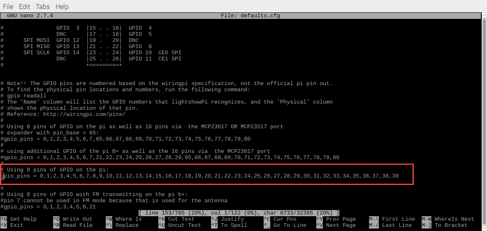

# Light show for PiHut's 3D Xmas Tree PCB for Raspberry Pi

These instructions will enable you to set Xmas tree board to light up/sync to music:

1) Install lightshowpi - http://lightshowpi.org/download-and-install/
2) Edit /home/pi/lightshowpi/config/defaults.cfg
  - Edit line 153 of the config file to include numbers 0-39
  
3) You can test to see if everything works by using:
  - sudo python /home/pi/lightshowpi/py/sychronized_lights.py --file=/home/pi/lightshowpi/music/sample/evilwezil_carol-of-the-bells.mp3
  
Sample video: https://twitter.com/majoras_flask/status/946461299189407744
  
There are still some kits available as of the time of this edit: https://thepihut.com/products/3d-xmas-tree-for-raspberry-pi?variant=38284925265
